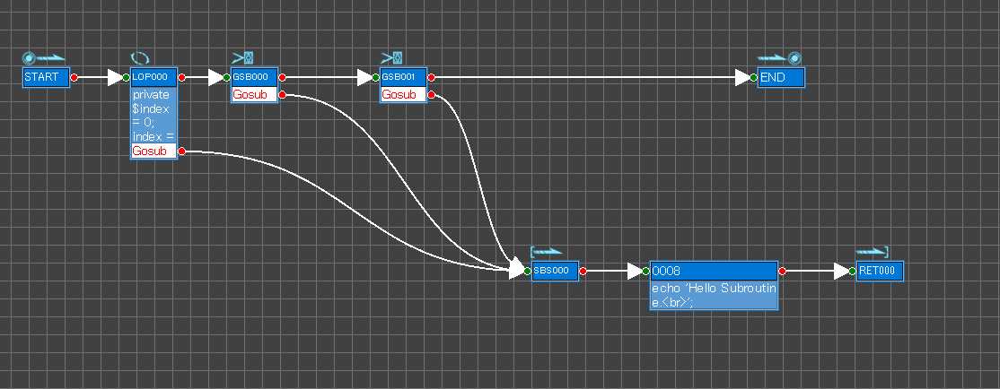
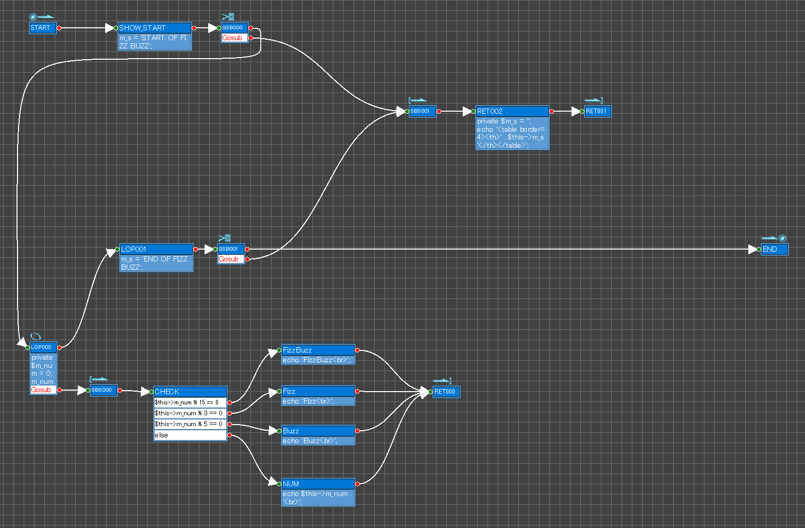

# psgg-php-sample

StateGo php sample

# ENVIRONMENT

Windows  
Xamp  
[StateGo](https://statego.programanic.com/)

# INSTRUCTION
  
1. Copy "Test" directory to htdocs in Xampp directory. 
2. Start Appache Server.
3. See http://localhost/Test/Test.php

You may use "FizzBuzz" too.

# Sample

TestContro.psgg

FizzBuzz.psgg

